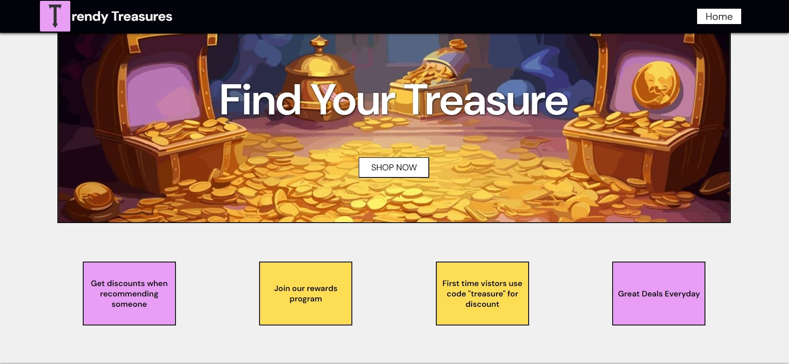

# Installation
> Note
>
> > [A live deployment of CV-Application is available on Vercel](https://shopping-cart-roan-chi.vercel.app/)

For those who would like to run the application and/or edit its source code on their local computer, follow the steps below:

1. Clone the repository with `git clone https://github.com/Jaime-Sanz/Shoppin-Cart` or download it as a .zip file and extract it.
2. Navigate to where the repository is saved on your local machine and open its index.html file on your preferred web browser.

# Usage
- View Products: Navigate through the product listings on the main page. Each product card displays a title, image, price, and rating.

# Learning Focus
The main focus of this project was to gain hands-on experience with React Router for client-side routing. The project follows The Odin Project’s curriculum as a guide, aiming to deepen understanding of React Router's capabilities and best practices in routing for single-page applications.

# Preview

| Shopping Page |
| --- |
|  |

# Built Using
> 

# Contributing
Feel free to submit an issue should a bug be found using the application.

# Disclaimer
- Work in Progress: This project is still under development. Features and functionality may be added or changed.

- Mock Data: The data used is from a mock API for demonstration purposes and does not represent real products or prices.

- Functionality: Some features, like checkout, are not fully implemented. The primary focus is on learning React Router and state management.

- Responsiveness & Security: Basic responsiveness is included, but there may be issues on different devices. Security measures are minimal and not suitable for production use.
# License
[MIT License](https://github.com/Jaime-Sanz/Shopping-Cart/blob/main/LICENSE)
# Contact Info
> Send a message by clicking on the icon!
> 
> 
